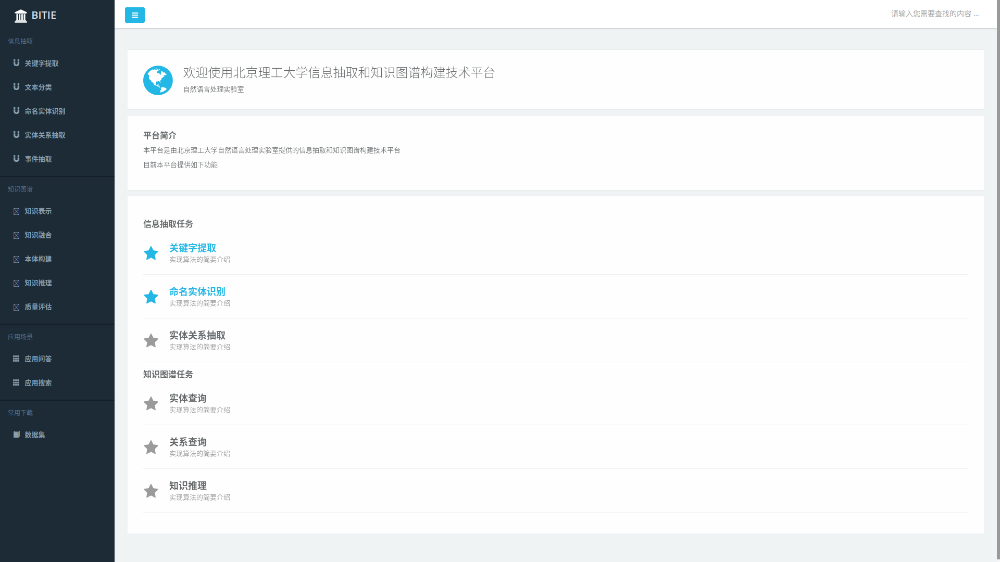
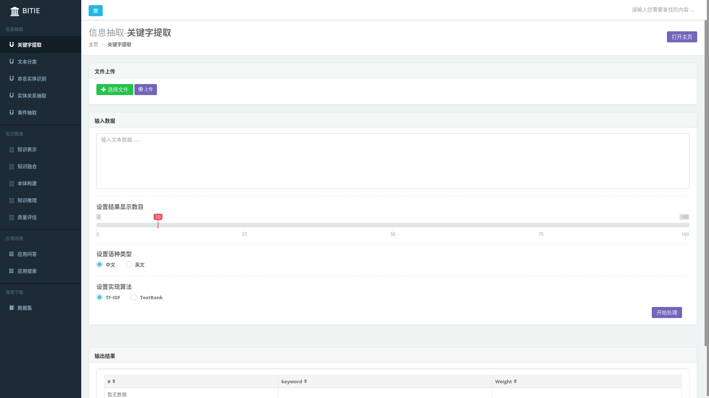
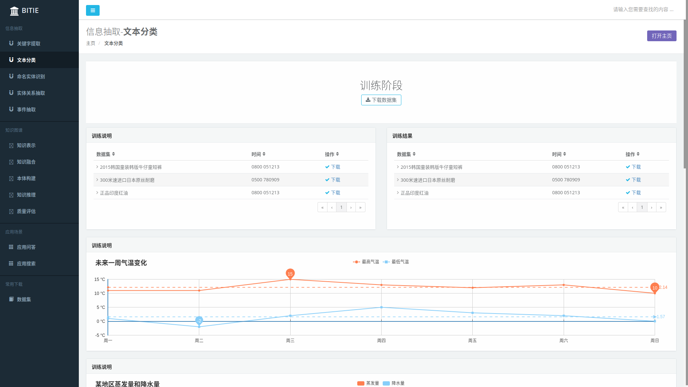

#### 面向特定领域的跨语言信息抽取和知识图谱构建技术验证平台(Domain-specific cross-language information extraction and knowledge graph mapping construction technology verification platform)

###### 信息抽取
- 关键字提取
- 文本分类
- 实体识别
- 关系抽取
- 事件抽取
  https://blog.csdn.net/hqc888688/article/details/73558824/
  https://blog.csdn.net/hqc888688/article/details/73558979/

###### 知识图谱
- 知识表示
- 属性和属性值抽取
- 实体消岐
- 语义类抽取
- 语义类生成
- 知识存储
- 知识融合(实体链接和知识合并)
- 知识加工
- 本体构建
- 知识推理
- 质量评估
- 知识更新
- 应用问答
- 应用搜索

**构建知识图谱的重点在于语义理解、知识表示、QA、智能对话和用户建模**
**知识图谱是一系列结构化数据的处理方法，它涉及知识的提取、 表示、存储、检索等诸多技术。从渊源上讲，它是知识表示与推理、数据库、信息检索、自然语言处理等多种技术发展的融合。**
**技术成本、团队成本和组织成本**
**知识图谱分为三个部分技术组成：**
- 知识获取，主要阐述如何从非结构化、半结构化、以及结构化数据中获取知识。
- 数据融合，主要阐述如何将不同数据源获取的知识进行融合构建数据之间的关联。
- 知识计算及应用，这一部分关注的是基于知识图谱计算功能以及基于知识图谱的应用。

https://www.jianshu.com/p/bd15e0f50eb9
https://www.jianshu.com/p/4f09043e22ea

###### 系统平台效果
###### 1.首页

###### 2.关键字抽取

###### 3.文本分类

